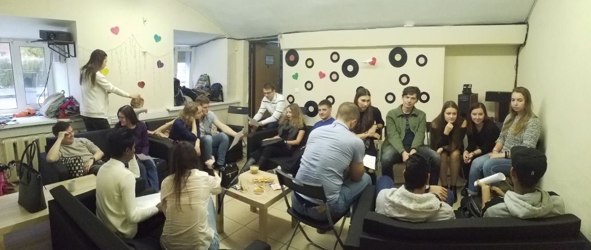

# English speaking club @ Geronimo

## Overview

English Speaking Club in Geronimo is aimed to unite people interested in English, willing to converse in this language and eager to spend time in a cosy atmosphere created by like-minded individuals.

Your English level isn't nearly as important as your desire to have a nice time talking in English as a member of a friendly company.

Traditionally, every meeting of the Club is dedicated to a chosen topic. During a meeting, all participants can get acquainted with one another, take part in exciting games and get involved in competitive tasks. In addition, native English speakers and other foreigners tend to be invited.

This group has been created to provide the latest information about the meetings as well as any movies, notes, songs, etc. related to our gatherings.

Every participant must pay for the time spent at Geronimo according to the organisation's requirements: 2,5 rubles per minute. The best part of it is that any guest can get unlimited access to tea, coffee and sweets for free during the time spent there.

[{Club group in vk}](https://vk.com/escnn)
[{Telegram chat}](https://t.me/escnn)

## The place

Geronimo time cafe located at Добролюбова 10.

[{Geronimo group in vk}](https://vk.com/geronimonn)
